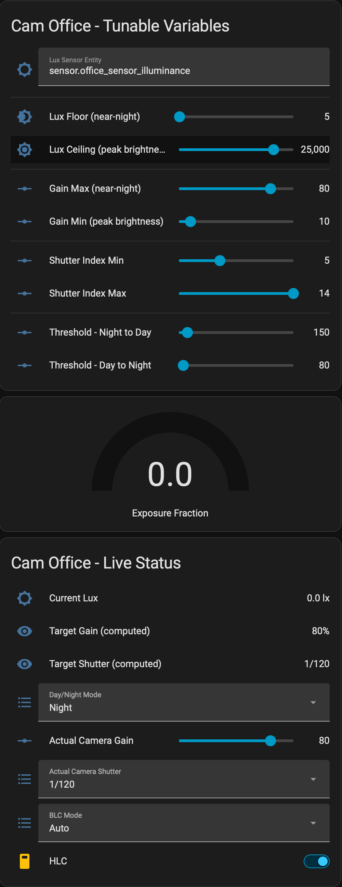

# Cam Office - Lux-Driven Camera Exposure Automation

A Home Assistant package that automatically adjusts a fixed-iris IP camera's
exposure (gain, shutter speed) and image-processing settings (HLC, BLC,
noise reduction, etc.) in real time based on ambient light, and switches the
camera between Day (color) and Night (B&W) modes with proper hysteresis to
avoid flapping at dusk/dawn or during passing clouds.

It was built for a Hikvision DS-2CD2385G1-I ("cam-office"), reading lux from
an Aeotec multisensor, but the lux sensor is swappable without editing YAML
(see **Configuration** below). The camera-side entity IDs are specific to
this camera's integration and *do* need editing if you reuse this for a
different camera.

## Why this exists

With a fixed iris, gain and shutter speed are the only two exposure controls
available. Rather than a handful of hardcoded "profiles," this automation
computes both continuously from the current lux reading using a log-scale
curve (light perception/exposure is roughly logarithmic, so this avoids
collapsing most of the useful range into a tiny sliver of the lux scale).
Everything else (HLC level, BLC mode, brightness/contrast/saturation/
sharpness/noise reduction) switches as a simple Day/Night pair, since those
don't need to track lux continuously the way exposure does.

## What it does

1. **Continuous exposure** — every minute, computes a normalized "how bright
   is it" fraction from the current lux reading and maps it onto:
   - **Gain** (0-100): high at night, low in bright light.
   - **Shutter speed**: snapped to the nearest of the camera's real shutter
     steps, slow at night, fast at peak brightness.
   Values are only written to the camera when they actually change, so it
   doesn't spam the device with redundant commands.

2. **Day/Night mode switching** — flips the camera's Day/Night mode (plus
   the non-exposure image settings) when lux crosses a threshold and *stays*
   there for a sustained period. Two different thresholds are used (higher
   to go Night→Day, lower to go Day→Night) so a brief cloud or sunbeam
   doesn't cause flapping.

3. Respects the camera integration's mutually-exclusive feature rules
   (enabling WDR auto-disables HLC/BLC and vice versa) by explicitly
   sequencing the relevant calls with short delays rather than firing them
   all at once.

## Files

| File | Purpose |
|---|---|
| `cam-office-lux-automation.yaml` | The package: helpers, template sensors, and automations. This is the actual logic. |
| `cam-office-lux-automation-dashboard-card.yaml` | A Lovelace card exposing all tunable variables and live status in one place. Optional, but makes tuning much easier than digging through Developer Tools. |
| `README.md` | This file. |

## Prerequisites

- Home Assistant with **packages** enabled in `configuration.yaml`:
  ```yaml
  homeassistant:
    packages: !include_dir_named packages
  ```
- A lux/illuminance sensor entity.
- **[Hikvision ISAPI Image Control](https://github.com/JoshADC/hikvision_isapi)** installed via HACS — this is what exposes the camera's gain, shutter speed, HLC, BLC, WDR, day/night mode, etc. as native `number`/`select`/`switch` entities that this automation reads and writes. It's not in the default HACS store, so add it as a custom repository:
  1. HACS → three-dot menu (top right) → **Custom repositories**
  2. Add `https://github.com/JoshADC/hikvision_isapi`, category **Integration**
  3. Install, then restart Home Assistant
  4. **Settings → Devices & Services → Add Integration** → search **Hikvision ISAPI Image Control** → enter your camera's IP and admin credentials
  5. Entities are auto-discovered based on your camera's capabilities, so the exact set (and the shutter speed list) can vary by model/firmware — confirm yours matches what's assumed in `cam-office-lux-automation.yaml` before deploying (see **Configuration** below).

  Its README notes you can't use the camera's own internal scene-switching/scheduling at the same time as this integration — this whole project exists to replace that with something lux-driven instead.
- If reusing this for a camera not covered by that integration: any integration exposing equivalent `number`/`select`/`switch` entities for gain, shutter speed, HLC, BLC, day/night mode, etc. will work, but entity IDs and available options will need adapting throughout.

## Installation

1. Copy `cam-office-lux-automation.yaml` to `/config/packages/`.
2. Confirm the `packages` line above is in `configuration.yaml`.
3. **Restart Home Assistant** (required the first time — a brand-new
   package file, and the `input_text`/`input_number`/`template` domains it
   introduces, need a full restart to be picked up; after this initial
   restart, future edits to this same file can usually be applied with
   Developer Tools → YAML → Reload, in this order: Input Text → Input
   Number → Template Entities → Automations).
4. Verify in **Developer Tools → States**: search `cam_office` and confirm
   the helpers and the three `sensor.cam_office_*` entities show real
   values, not `unknown`/`unavailable`.
5. (Optional) Add `cam-office-lux-automation-dashboard-card.yaml`'s contents as a Lovelace
   card: **Edit Dashboard → Add Card → Manual**, paste it in.

## Dashboard Card



The card has three sections:

**Tunable Variables** — the `input_number`/`input_text` helpers that shape
the exposure curve and day/night thresholds. **Editing these here is always
safe and never gets overwritten** — the automations only *read* these
values, they never write to them. Change one, and the next automation cycle
(within a minute for exposure, or the next lux crossing for thresholds)
picks it up.

**Exposure Fraction gauge** — a read-only visual of the current normalized
brightness value (0 = your configured "floor" lux, 1 = your configured
"ceiling"). Not editable; it's a computed `sensor`, so there's nothing to
overwrite here either way.

**Live Status** — this section is a mix, and behaves differently depending
on the row:

| Row | If you change it manually |
|---|---|
| Current Lux | Read-only sensor — can't be edited here regardless. |
| Target Gain / Target Shutter (computed) | Read-only sensors — reflect what the formula wants, not editable. |
| **Actual Camera Gain** | Editable, but the exposure automation re-checks every minute and will **overwrite it back** to the computed target within about 60 seconds if it differs. |
| **Actual Camera Shutter** | Same as above — **overwritten within about a minute** if it drifts from the computed target. |
| Day/Night Mode | Editable, and **not touched by the per-minute exposure automation**. It only gets changed by the Day/Night Switch automation, which only fires on a sustained threshold crossing — so a manual change here can persist for hours until the next real dusk/dawn transition (or indefinitely, if lux never crosses back the other way). |
| BLC Mode / HLC | Same as Day/Night Mode — only touched by the Day/Night Switch automation, so manual changes stick until the next mode flip. |

So in short: anything under **Tunable Variables** is a permanent, safe
override. Anything under **Live Status** that's also part of the *exposure*
loop (gain, shutter) will drift back within a minute. Anything under
**Live Status** that's part of the *day/night* loop (mode, BLC, HLC) will
stick until the next real transition — useful for testing a manual
override for a while, but don't forget it's not "sticky forever."

## Configuration — what to edit for your setup

### Required: your camera's entity IDs

Every `number.`, `select.`, and `switch.` entity referencing the camera
(e.g. `number.ds_2cd2385g1_i_cam_office_zutzut_com_gain`) uses this specific
camera's entity prefix. Find-and-replace that prefix with your own camera's
entity IDs throughout `cam-office-lux-automation.yaml`. Also re-check:

- Your shutter speed `select` entity's actual list of options — the
  index-mapping logic assumes a specific ordered list of 15 values
  (`1/3` through `1/100000`). Update the `shutter_options` list in the
  template section to match your camera's real options.
- Your camera's actual feature-exclusivity rules, if any — the Day/Night
  switch automation sequences BLC/HLC changes with short delays assuming
  this camera's specific WDR/HLC/BLC exclusivity behavior.
- The specific numeric values used in the Day/Night switch automation's
  "apply this image profile" steps (brightness, contrast, saturation, etc.)
  — these were tuned to this Pierre's specific camera/environment and will
  need re-tuning for any other install.

### No YAML editing needed: the lux sensor

The lux sensor is *not* hardcoded — it's resolved at runtime through
`input_text.cam_office_lux_sensor_entity_id`. To point this at a different
sensor, just change that helper's text value (Settings → Devices & Services
→ Helpers, or the dashboard card) to the new entity_id. No reload needed.

### Tunable variables (all live-adjustable via Helpers or the dashboard card, no YAML/reload needed)

| Helper | Meaning |
|---|---|
| `..._lux_floor` | Lux treated as "fully dark" (bottom of the exposure curve) |
| `..._lux_ceiling` | Lux treated as "fully bright" (top of the exposure curve) |
| `..._gain_max` / `..._gain_min` | Camera gain at the floor/ceiling of the curve |
| `..._shutter_idx_min` / `..._shutter_idx_max` | Index into the shutter options list at floor/ceiling (0 = slowest, 14 = fastest, for the default 15-option list) |
| `..._lux_night_to_day` | Lux threshold to switch Night → Day (higher, to resist flapping) |
| `..._lux_day_to_night` | Lux threshold to switch Day → Night (lower) |
| `cam_office_lux_sensor_entity_id` | Entity ID of the lux sensor to read |

Both Day/Night thresholds require the crossing to hold for **10 minutes**
before switching (hardcoded in the automation's `for:` — not a dashboard
value, since it's an automation-structure choice rather than a per-install
tuning knob).

## Troubleshooting

- **A helper/sensor shows `unavailable`**: check Settings → System → Logs
  for a template rendering error on that entity — a common cause is a type
  mismatch (e.g. using a float where a list index needs an int).
- **An automation entity gets a `_2` suffix after an edit**: this happens
  if the automation's internal `id:` field changes — Home Assistant treats
  that as a brand-new automation rather than an update to the existing one,
  leaving an orphaned duplicate behind. Check Settings → Devices & Services
  → Entities (not the Automations list, which only shows active config) to
  find and delete the orphan, then do a full restart to reconcile.
- **Automation editor shows "unknown entity"**: for `template:` sensors,
  the actual entity_id is derived from the `name:` field, *not* from
  `unique_id`. If you renamed `unique_id` without also renaming `name:`,
  references elsewhere will point at an entity_id that was never created.
- **Checking what actually happened**: Settings → Automations & Scenes →
  open an automation → Traces tab shows exactly which trigger fired, which
  conditions passed/failed, and the rendered value of every action step.

## Known limitations

- HLC level, BLC mode, and the brightness/contrast/saturation/sharpness/
  noise-reduction numbers are a simple Day/Night binary, not lux-continuous
  — they were only tuned from two known-good snapshots (one day, one
  night), not a full curve.
- The dusk/dawn "twilight zone" (roughly 60-150 lux) is an inherent
  compromise: too bright for clean B&W night mode, too dim for clean color
  daytime video. Expect some tuning iteration here — trade-offs between
  noise (needs slower shutter/lower gain) and motion blur (needs faster
  shutter) don't have a single objectively-correct answer.
